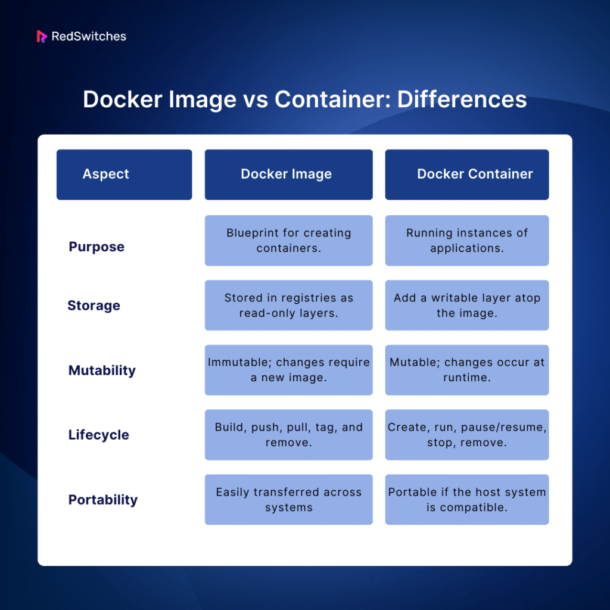
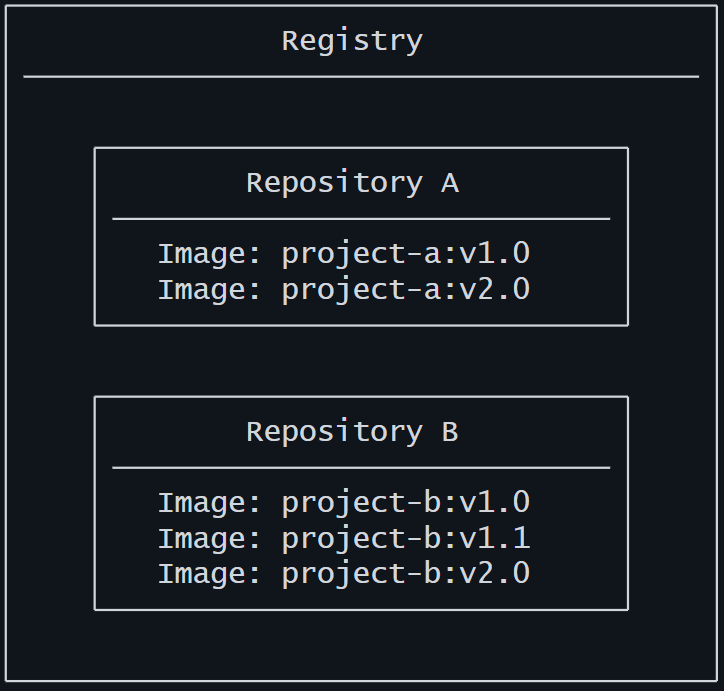

# 🐳 What Docker Actually Is (Deep Level)

Docker is an open platform for developing, shipping, and running applications. Docker enables you to separate your applications from your infrastructure so you can deliver software quickly. With Docker, you can manage your infrastructure in the same ways you manage your applications. By taking advantage of Docker's methodologies for shipping, testing, and deploying code, you can significantly reduce the delay between writing code and running it in production.

Docker is containerization using OS-level virtualization.

🔥 Key idea most people miss:

Docker does NOT run a full OS like a VM.

Instead it uses:

Namespaces → isolate processes
cgroups → limit CPU/RAM
Union File System (OverlayFS) → layered filesystem

👉 So containers are:

Just isolated processes on your host OS

### What can I use Docker for?
#### Fast, consistent delivery of your applications
Docker streamlines the development lifecycle by allowing developers to work in standardized environments using local containers which provide your applications and services. Containers are great for continuous integration and continuous delivery (CI/CD) workflows.

Consider the following example scenario:

- Your developers write code locally and share their work with their colleagues using Docker containers.
- They use Docker to push their applications into a test environment and run automated and manual tests.
- When developers find bugs, they can fix them in the development environment and redeploy them to the test environment for testing and validation.
- When testing is complete, getting the fix to the customer is as simple as pushing the updated image to the production environment.

#### Responsive deployment and scaling
Docker's container-based platform allows for highly portable workloads. Docker containers can run on a developer's local laptop, on physical or virtual machines in a data center, on cloud providers, or in a mixture of environments.

Docker's portability and lightweight nature also make it easy to dynamically manage workloads, scaling up or tearing down applications and services as business needs dictate, in near real time.

#### Running more workloads on the same hardware
Docker is lightweight and fast. It provides a viable, cost-effective alternative to hypervisor-based virtual machines, so you can use more of your server capacity to achieve your business goals. Docker is perfect for high density environments and for small and medium deployments where you need to do more with fewer resources.

### 🧠 Image vs Container (REAL understanding)
docker image is build and docker image can create a docker container.


👉 Flow:
```
Dockerfile → Image → Container
```

# 🧱 Docker Architecture

Docker uses a client-server architecture. The Docker client talks to the Docker daemon, which does the heavy lifting of building, running, and distributing your Docker containers. The Docker client and daemon can run on the same system, or you can connect a Docker client to a remote Docker daemon. The Docker client and daemon communicate using a REST API, over UNIX sockets or a network interface. Another Docker client is Docker Compose, that lets you work with applications consisting of a set of containers.

#### Components:

- Docker Client (docker)
- Docker Daemon (dockerd)
- Registry (like Docker Hub)
- Docker objects
    - Images (layered)
    - Containers


#### The Docker client
The Docker client (docker) is the primary way that many Docker users interact with Docker. When you use commands such as docker run, the client sends these commands to dockerd, which carries them out. The docker command uses the Docker API. The Docker client can communicate with more than one daemon.

#### The Docker daemon
The Docker daemon (dockerd) listens for Docker API requests and manages Docker objects such as images, containers, networks, and volumes. A daemon can also communicate with other daemons to manage Docker services.

#### Docker registries
A Docker registry stores Docker images. Docker Hub is a public registry that anyone can use, and Docker looks for images on Docker Hub by default. You can even run your own private registry.

When you use the docker pull or docker run commands, Docker pulls the required images from your configured registry. When you use the docker push command, Docker pushes your image to your configured registry.

#### Docker objects
When you use Docker, you are creating and using images, containers, networks, volumes, plugins, and other objects. This section is a brief overview of some of those objects.

##### Images
An image is a read-only template with instructions for creating a Docker container. Often, an image is based on another image, with some additional customization. For example, you may build an image that is based on the Ubuntu image but includes the Apache web server and your application, as well as the configuration details needed to make your application run.

You might create your own images or you might only use those created by others and published in a registry. To build your own image, you create a Dockerfile with a simple syntax for defining the steps needed to create the image and run it. Each instruction in a Dockerfile creates a layer in the image. When you change the Dockerfile and rebuild the image, only those layers which have changed are rebuilt. This is part of what makes images so lightweight, small, and fast, when compared to other virtualization technologies.

##### Containers
A container is a runnable instance of an image. You can create, start, stop, move, or delete a container using the Docker API or CLI. You can connect a container to one or more networks, attach storage to it, or even create a new image based on its current state.

By default, a container is relatively well isolated from other containers and its host machine. You can control how isolated a container's network, storage, or other underlying subsystems are from other containers or from the host machine.

A container is defined by its image as well as any configuration options you provide to it when you create or start it. When a container is removed, any changes to its state that aren't stored in persistent storage disappear.

Example ```docker run``` command

The following command runs an ubuntu container, attaches interactively to your local command-line session, and runs ```/bin/bash.```


```docker run -i -t ubuntu /bin/bash```

When you run this command, the following happens (assuming you are using the default registry configuration):

- If you don't have the ```ubuntu``` image locally, Docker pulls it from your configured registry, as though you had run ```docker pull ubuntu``` manually.

- Docker creates a new container, as though you had run a ```docker container create``` command manually.

- Docker allocates a read-write filesystem to the container, as its final layer. This allows a running container to create or modify files and directories in its local filesystem.

- Docker creates a network interface to connect the container to the default network, since you didn't specify any networking options. This includes assigning an IP address to the container. By default, containers can connect to external networks using the host machine's network connection.

- Docker starts the container and executes ```/bin/bash.``` Because the container is running interactively and attached to your terminal (due to the ```-i``` and ```-t``` flags), you can provide input using your keyboard while Docker logs the output to your terminal.

- When you run ```exit``` to terminate the ```/bin/bash``` command, the container stops but isn't removed. You can start it again or remove it.

<details><summary> Containerd
</summary>

<dev>

containerd is a lightweight, high-performance container runtime originally developed by Docker and now maintained by the Cloud Native Computing Foundation.

It is responsible for:

- Pulling container images
- Managing container lifecycle (start, stop, pause, delete)
- Handling storage & networking (via plugins)
- Running containers using OS features (namespaces, cgroups)

##### 🔹 Where containerd fits (Big Picture)

Think of the stack like this:
```
Kubernetes
   ↓
container runtime (containerd)
   ↓
Linux Kernel (namespaces, cgroups)
```
Or in Docker:
```
Docker CLI
   ↓
Docker Engine
   ↓
containerd
   ↓
runc
   ↓
Linux Kernel
```
👉 Important:
- Docker uses containerd internally
- Kubernetes can use containerd directly (without Docker)

🔹 Key Components inside containerd
1. Image Management
    - Pulls images from registries (Docker Hub, etc.)
    - Stores images locally
2. Container Lifecycle
    - Create → Start → Stop → Delete containers
3. Snapshotters
    - Manage filesystem layers (overlayfs, btrfs, etc.)
4. Runtime (runc)
    - Uses runc to actually spawn containers

<dev>
</details>

|==================================================================|

#### What you'll learn
- Run your first container
- Build your first image
- Publish your image on Docker Hub

#### Modules
##### 1. Run your first container<br>
Open your CLI terminal and start a container by running the docker run command:
```
docker run -d -p 8080:80 docker/welcome-to-docker
```
<details>
<summary>Explaination</summary>
<dev>

```
🔹docker run

This is the command to create and start a container from an image.

If the image doesn’t exist locally, Docker will pull it from Docker Hub automatically.
Then it creates a container and runs it.

🔹-d (detached mode)

This tells Docker to run the container in the background.

Without -d: logs appear in your terminal and block it
With -d: container runs silently, and you get your terminal back

👉 Think: “run it as a background service”

🔹-p 8080:80 (port mapping)

This maps ports between your machine and the container.

Format:

-p <host_port>:<container_port>

So here:

8080 → your local machine (host)
80 → inside the container

👉 Meaning:
When you open:

http://localhost:8080

it forwards traffic to:

container:80
🔹docker/welcome-to-docker

This is the image name.

It’s hosted on Docker Hub
It’s a simple web app that runs on port 80 inside the container

```

</dev>
</details>

Access the frontend
For this container, the frontend is accessible on port 8080. To open the website, visit http://localhost:8080 in your browser.

<details>
<summary>🔥 Extra useful commands</summary>

<dev>

Check running containers:
```
docker ps
```
Stop the container:
```
docker stop <container_id>
```
View logs:
```
docker logs <container_id>
```

</dev>
</details>

<details> <summary>
Develop with containers
</summary>

<dev> 

- You can have a docker compose file which will have multiple config for application’s services.
- run ``` docker compose watch ``` and make a changes to the required files in the project and save, that will be reflected.

</dev>
</details>

</details>

<details> <summary>
Build and push your first image
</summary>

<dev> 

1. To get started, either clone or download the project as a ZIP file to your local machine.

```
 git clone https://github.com/docker/getting-started-todo-app
 ```
And after the project is cloned, navigate into the new directory created by the clone:
```
 cd getting-started-todo-app
```
2. Build the project by running the following command, swapping out ```DOCKER_USERNAME``` with your username.
```
 docker build -t DOCKER_USERNAME/getting-started-todo-app .
```
For example, if your Docker username was ```mobydock```, you would run the following:
```
 docker build -t mobydock/getting-started-todo-app .
```
To verify the image exists locally, you can use the ```docker image ls``` command:
```
 docker image ls
```
You will see output similar to the following:
```
REPOSITORY                          TAG       IMAGE ID       CREATED          SIZE
mobydock/getting-started-todo-app   latest    1543656c9290   2 minutes ago    1.12GB
...
```
To push the image, use the ```docker push``` command. Be sure to replace ```DOCKER_USERNAME``` with your username:
```
 docker push DOCKER_USERNAME/getting-started-todo-app
```
Depending on your upload speeds, this may take a moment to push.

</dev>
</details>

=================================================================

### ✍🏼 Docker Concepts

<details> <summary>
Docker Basic
</summary>

<dev> 

- What is a container?

   Imagine you're developing a killer web app that has three main components - a React frontend, a Python API, and a PostgreSQL database. If you wanted to work on this project, you'd have to install Node, Python, and PostgreSQL.

   How do you make sure you have the same versions as the other developers on your team? Or your CI/CD system? Or what's used in production?

   How do you ensure the version of Python (or Node or the database) your app needs isn't affected by what's already on your machine? How do you manage potential conflicts?

   Enter containers!

   What is a container? Simply put, containers are isolated processes for each of your app's components. Each component - the frontend React app, the Python API engine, and the database - runs in its own isolated environment, completely isolated from everything else on your machine.

   Here's what makes them awesome. Containers are:

   - Self-contained. Each container has everything it needs to function with no reliance on any pre-installed dependencies on the host machine.
   - Isolated. Since containers run in isolation, they have minimal influence on the host and other containers, increasing the security of your applications.
   - Independent. Each container is independently managed. Deleting one container won't affect any others.
   - Portable. Containers can run anywhere! The container that runs on your development machine will work the same way in a data center or anywhere in the cloud!


- What is an image?

   Seeing as a container is an isolated process, where does it get its files and configuration? How do you share those environments?

   That's where container images come in. A container image is a standardized package that includes all of the files, binaries, libraries, and configurations to run a container.

   For a PostgreSQL image, that image will package the database binaries, config files, and other dependencies. For a Python web app, it'll include the Python runtime, your app code, and all of its dependencies.

   There are two important principles of images:

   - Images are immutable. Once an image is created, it can't be modified. You can only make a new image or add changes on top of it.

   - Container images are composed of layers. Each layer represents a set of file system changes that add, remove, or modify files.

   These two principles let you to extend or add to existing images. For example, if you are building a Python app, you can start from the Python image and add additional layers to install your app's dependencies and add your code. This lets you focus on your app, rather than Python itself.

   Try it out

   1. Open a terminal and search for images using the ```docker search``` command:
      ```
      docker search docker/welcome-to-docker
      ```

      You will see output like the following:
      ```
      NAME                       DESCRIPTION                                     STARS     OFFICIAL
      docker/welcome-to-docker   Docker image for new users getting started w…   20
      ```

      This output shows you information about relevant images available on Docker Hub.

   2. Pull the image using the ```docker pull``` command.
      ```
      docker pull docker/welcome-to-docker
      ```
      You will see output like the following:


      ```
      Using default tag: latest
      latest: Pulling from docker/welcome-to-docker
      579b34f0a95b: Download complete
      d11a451e6399: Download complete
      1c2214f9937c: Download complete
      b42a2f288f4d: Download complete
      54b19e12c655: Download complete
      1fb28e078240: Download complete
      94be7e780731: Download complete
      89578ce72c35: Download complete
      Digest: sha256:eedaff45e3c78538087bdd9dc7afafac7e110061bbdd836af4104b10f10ab693
      Status: Downloaded newer image for docker/welcome-to-docker:latest
      docker.io/docker/welcome-to-docker:latest
      ```

      Each of line represents a different downloaded layer of the image. Remember that each layer is a set of filesystem changes and provides functionality of the image.

   Learn about the image
   1. List your downloaded images using the ```docker image ls ```command:
      ```
      docker image ls
      ```
      You will see output like the following:
      ```
      REPOSITORY                 TAG       IMAGE ID       CREATED        SIZE
      docker/welcome-to-docker   latest    eedaff45e3c7   4 months ago   29.7MB
      ```
      The command shows a list of Docker images currently available on your system. The ```docker/welcome-to-docker``` has a total size of approximately 29.7MB.

      ```
      Image size

      The image size represented here reflects the uncompressed size of the image, not the download size of the layers.
      ```

   2. List the image's layers using the docker image history command:
      ```
      docker image history docker/welcome-to-docker
      ```
      You will see output like the following:

      ```
      IMAGE          CREATED        CREATED BY                                      SIZE      COMMENT
      648f93a1ba7d   4 months ago   COPY /app/build /usr/share/nginx/html # buil…   1.6MB     buildkit.dockerfile.v0
      <missing>      5 months ago   /bin/sh -c #(nop)  CMD ["nginx" "-g" "daemon…   0B
      <missing>      5 months ago   /bin/sh -c #(nop)  STOPSIGNAL SIGQUIT           0B
      <missing>      5 months ago   /bin/sh -c #(nop)  EXPOSE 80                    0B
      <missing>      5 months ago   /bin/sh -c #(nop)  ENTRYPOINT ["/docker-entr…   0B
      <missing>      5 months ago   /bin/sh -c #(nop) COPY file:9e3b2b63db9f8fc7…   4.62kB
      <missing>      5 months ago   /bin/sh -c #(nop) COPY file:57846632accc8975…   3.02kB
      <missing>      5 months ago   /bin/sh -c #(nop) COPY file:3b1b9915b7dd898a…   298B
      <missing>      5 months ago   /bin/sh -c #(nop) COPY file:caec368f5a54f70a…   2.12kB
      <missing>      5 months ago   /bin/sh -c #(nop) COPY file:01e75c6dd0ce317d…   1.62kB
      <missing>      5 months ago   /bin/sh -c set -x     && addgroup -g 101 -S …   9.7MB
      <missing>      5 months ago   /bin/sh -c #(nop)  ENV PKG_RELEASE=1            0B
      <missing>      5 months ago   /bin/sh -c #(nop)  ENV NGINX_VERSION=1.25.3     0B
      <missing>      5 months ago   /bin/sh -c #(nop)  LABEL maintainer=NGINX Do…   0B
      <missing>      5 months ago   /bin/sh -c #(nop)  CMD ["/bin/sh"]              0B
      <missing>      5 months ago   /bin/sh -c #(nop) ADD file:ff3112828967e8004…   7.66MB
      ```

      This output shows you all of the layers, their sizes, and the command used to create the layer.

- What is a registry?

   Now that you know what a container image is and how it works, you might wonder - where do you store these images?

   Well, you can store your container images on your computer system, but what if you want to share them with your friends or use them on another machine? That's where the image registry comes in.

   An image registry is a centralized location for storing and sharing your container images. It can be either public or private. Docker Hub is a public registry that anyone can use and is the default registry.

   While Docker Hub is a popular option, there are many other available container registries available today, including Amazon Elastic Container Registry (ECR), Azure Container Registry (ACR), and Google Container Registry (GCR). You can even run your private registry on your local system or inside your organization. For example, Harbor, JFrog Artifactory, GitLab Container registry etc.

   Registry vs. repository
   While you're working with registries, you might hear the terms registry and repository as if they're interchangeable. Even though they're related, they're not quite the same thing.

   A registry is a centralized location that stores and manages container images, whereas a repository is a collection of related container images within a registry. Think of it as a folder where you organize your images based on projects. Each repository contains one or more container images.

   The following diagram shows the relationship between a registry, repositories, and images.

   

   Try it out

   1. Run the following command to build a Docker image, swapping out YOUR_DOCKER_USERNAME with your username.

      ```
      docker build -t <YOUR_DOCKER_USERNAME>/docker-quickstart .
      ```

   2. Run the following command to list the newly created Docker image:
      ```
      docker images
      ```
      You will see output like the following:
      ```
      REPOSITORY                                 TAG       IMAGE  ID       CREATED         SIZE
      <YOUR_DOCKER_USERNAME>/docker-quickstart   latest    476de364f70e   2 minutes ago   170MB
      ```
   3. Start a container to test the image by running the following command (swap out the username with your own username):
      ```
      docker run -d -p 8080:8080 <YOUR_DOCKER_USERNAME>/docker-quickstart 
      ```
      You can verify if the container is working by visiting http://localhost:8080 with your browser.

   4. Use the docker tag command to tag the Docker image. Docker tags allow you to label and version your images.
      ```
      docker tag <YOUR_DOCKER_USERNAME>/docker-quickstart         <YOUR_DOCKER_USERNAME>/docker-quickstart:1.0 
      ```
   5. Finally, it's time to push the newly built image to your Docker Hub repository by using the docker push command:
      ```
      docker push <YOUR_DOCKER_USERNAME>/docker-quickstart:1.0
      ```
   6. Open Docker Hub and navigate to your repository. Navigate to the Tags section and see your newly pushed image

- What is Docker Compose?

   If you've been following the guides so far, you've been working with single container applications. But, now you're wanting to do something more complicated - run databases, message queues, caches, or a variety of other services. Do you install everything in a single container? Run multiple containers? If you run multiple, how do you connect them all together?

   One best practice for containers is that each container should do one thing and do it well. While there are exceptions to this rule, avoid the tendency to have one container do multiple things.

   You can use multiple ```docker run``` commands to start multiple containers. But, you'll soon realize you'll need to manage networks, all of the flags needed to connect containers to those networks, and more. And when you're done, cleanup is a little more complicated.

   With Docker Compose, you can define all of your containers and their configurations in a single YAML file. If you include this file in your code repository, anyone that clones your repository can get up and running with a single command.

   It's important to understand that Compose is a declarative tool - you simply define it and go. You don't always need to recreate everything from scratch. If you make a change, run ```docker compose up``` again and Compose will reconcile the changes in your file and apply them intelligently.

   ```
   Dockerfile versus Compose file

   A Dockerfile provides instructions to build a container image while a Compose file defines your running containers. Quite often, a Compose file references a Dockerfile to build an image to use for a particular service.
   ```
   Try it out

   1. Open a terminal and clone this sample application.
      ```
      git clone https://github.com/dockersamples/todo-list-app 
      ```
   2. Navigate into the todo-list-app directory:
      ```
      cd todo-list-app
      ```
      Inside this directory, you'll find a file named compose.yaml. This YAML file is where all the magic happens! It defines all the services that make up your application, along with their configurations. Each service specifies its image, ports, volumes, networks, and any other settings necessary for its functionality. Take some time to explore the YAML file and familiarize yourself with its structure.
   
   3. Use the ```docker compose up``` command to start the application:
      ```
      docker compose up -d --build
      ```
      When you run this command, you should see an output like this:
      ```
      [+] Running 5/5
         ✔ app 3 layers [⣿⣿⣿]      0B/0B            Pulled          7.1s
         ✔ e6f4e57cc59e Download complete                          0.9s
         ✔ df998480d81d Download complete                          1.0s
         ✔ 31e174fedd23 Download complete                          2.5s
         ✔ 43c47a581c29 Download complete                          2.0s
      [+] Running 4/4
         ⠸ Network todo-list-app_default           Created         0.3s
         ⠸ Volume "todo-list-app_todo-mysql-data"  Created         0.3s
         ✔ Container todo-list-app-app-1           Started         0.3s
         ✔ Container todo-list-app-mysql-1         Started         0.3s
      ```

Tear it down

   In the CLI, use the docker compose down command to remove everything:
      ```
      docker compose down
      ```
      You'll see output similar to the following:
      ```
      [+] Running 3/3
         ✔ Container todo-list-app-mysql-1  Removed        2.9s
         ✔ Container todo-list-app-app-1    Removed        0.1s
         ✔ Network todo-list-app_default    Removed        0.1s

   Volume persistence

   By default, volumes aren't automatically removed when you tear down a Compose stack. The idea is that you might want the data back if you start the stack again.

   If you do want to remove the volumes, add the --volumes flag when running the docker compose down command:

   ```
   docker compose down --volumes
   
   [+] Running 1/0
   ✔ Volume todo-list-app_todo-mysql-data  Removed
   ```

</dev>
</details>

<details> <summary>
Building images
</summary>

<dev> 

- Understanding image layers

   As you learned in What is an image?, container images are composed of layers. And each of these layers, once created, are immutable. But, what does that actually mean? And how are those layers used to create the filesystem a container can use?

   Image layers<br>
   Each layer in an image contains a set of filesystem changes - additions, deletions, or modifications. Let’s look at a theoretical image:

   - The first layer adds basic commands and a package manager, such as apt.
   - The second layer installs a Python runtime and pip for dependency management.
   - The third layer copies in an application’s specific requirements.txt file.
   - The fourth layer installs that application’s specific dependencies.
   - The fifth layer copies in the actual source code of the application.

   This example might look like:
   
   

   This is beneficial because it allows layers to be reused between images. For example, imagine you wanted to create another Python application. Due to layering, you can leverage the same Python base. This will make builds faster and reduce the amount of storage and bandwidth required to distribute the images. The image layering might look similar to the following:
   
   

   Layers let you extend images of others by reusing their base layers, allowing you to add only the data that your application needs.

   <b>Stacking the layers</b>

   Layering is made possible by content-addressable storage and union filesystems. While this will get technical, here’s how it works:

   - After each layer is downloaded, it is extracted into its own directory on the host filesystem.
   - When you run a container from an image, a union filesystem is created where layers are stacked on top of each other, creating a new and unified view.
   - When the container starts, its root directory is set to the location of this unified directory, using ```chroot```.

   When the union filesystem is created, in addition to the image layers, a directory is created specifically for the running container. This allows the container to make filesystem changes while allowing the original image layers to remain untouched. This enables you to run multiple containers from the same underlying image.

   <b>Create a base image</b>
   
   In this first step, you will create your own base image that you will then use for the following steps.

   1. Download and install Docker Desktop.

   2. In a terminal, run the following command to start a new container:

      ```
      docker run --name=base-container -ti ubuntu
      ```

      Once the image has been downloaded and the container has started, you should see a new shell prompt. This is running inside your container. It will look similar to the following (the container ID will vary):

      ```
      root@d8c5ca119fcd:/#
      ```
   3. Inside the container, run the following command to install Node.js:
      ```
      apt update && apt install -y nodejs
      ```
      When this command runs, it downloads and installs Node inside the container. In the context of the union filesystem, these filesystem changes occur within the directory unique to this container.

   4. Validate if Node is installed by running the following command:
      ```
      node -e 'console.log("Hello world!")'
      ```
      You should then see a “Hello world!” appear in the console.

   5. Now that you have Node installed, you’re ready to save the changes you’ve made as a new image layer, from which you can start new containers or build new images. To do so, you will use the ```docker container commit``` command. Run the following command in a new terminal:
      ```
      docker container commit -m "Add node" base-container node-base
      ```

   6. View the layers of your image using the docker image history command:

      ```
      docker image history node-base
      ```
      You will see output similar to the following:

      ```
      IMAGE          CREATED          CREATED BY                                      SIZE      COMMENT
      9e274734bb25   10 seconds ago   /bin/bash                                       157MB     Add node
      cd1dba651b30   7 days ago       /bin/sh -c #(nop)  CMD ["/bin/bash"]            0B
      <missing>      7 days ago       /bin/sh -c #(nop) ADD file:6089c6bede9eca8ec…   110MB
      <missing>      7 days ago       /bin/sh -c #(nop)  LABEL org.opencontainers.…   0B
      <missing>      7 days ago       /bin/sh -c #(nop)  LABEL org.opencontainers.…   0B
      <missing>      7 days ago       /bin/sh -c #(nop)  ARG LAUNCHPAD_BUILD_ARCH     0B
      <missing>      7 days ago       /bin/sh -c #(nop)  ARG RELEASE                  0B

      ```
      Note the “Add node” comment on the top line. This layer contains the Node.js install you just made.

   7. To prove your image has Node installed, you can start a new container using this new image:

      ```
      docker run node-base node -e "console.log('Hello again')"
      ```

      With that, you should get a “Hello again” output in the terminal, showing Node was installed and working.

   8. Now that you’re done creating your base image, you can remove that container:

      ```
      docker rm -f base-container
      ```
   
   ```
   Base image definition

   A base image is a foundation for building other images. It's possible to use any images as a base image. However, some images are intentionally created as building blocks, providing a foundation or starting point for an application.

   In this example, you probably won’t deploy this node-base image, as it doesn’t actually do anything yet. But it’s a base you can use for other builds.
   ```

   <b>Build an app image</b>

   Now that you have a base image, you can extend that image to build additional images.

   1. Start a new container using the newly created node-base image:

      ```
      docker run --name=app-container -ti node-base
      ```
   2. Inside of this container, run the following command to create a Node program:

      ```
      echo 'console.log("Hello from an app")' > app.js
      ```
      To run this Node program, you can use the following command and see the message printed on the screen:

      ```
      node app.js
      ```
   3. In another terminal, run the following command to save this container’s changes as a new image:

      ```
      docker container commit -c "CMD node app.js" -m "Add app" app-container sample-app
      ```

      This command not only creates a new image named sample-app, but also adds additional configuration to the image to set the default command when starting a container. In this case, you are setting it to automatically run node app.js.

   4. In a terminal outside of the container, run the following command to view the updated layers:

      ```
      docker image history sample-app
      ```

      You’ll then see output that looks like the following. Note the top layer comment has “Add app” and the next layer has “Add node”:

      ```
      IMAGE          CREATED              CREATED BY                                      SIZE      COMMENT
      c1502e2ec875   About a minute ago   /bin/bash                                       33B       Add app
      5310da79c50a   4 minutes ago        /bin/bash                                       126MB     Add node
      2b7cc08dcdbb   5 weeks ago          /bin/sh -c #(nop)  CMD ["/bin/bash"]            0B
      <missing>      5 weeks ago          /bin/sh -c #(nop) ADD file:07cdbabf782942af0…   69.2MB
      <missing>      5 weeks ago          /bin/sh -c #(nop)  LABEL org.opencontainers.…   0B
      <missing>      5 weeks ago          /bin/sh -c #(nop)  LABEL org.opencontainers.…   0B
      <missing>      5 weeks ago          /bin/sh -c #(nop)  ARG LAUNCHPAD_BUILD_ARCH     0B
      <missing>      5 weeks ago          /bin/sh -c #(nop)  ARG RELEASE                  0B
      ```
   5. Finally, start a new container using the brand new image. Since you specified the default command, you can use the following command:

      ```
      docker run sample-app
      ```
      You should see your greeting appear in the terminal, coming from your Node program.

   6. Now that you’re done with your containers, you can remove them using the following command:

      ```
      docker rm -f app-container
      ```


- Writing a Dockerfile

   <b>Explanation</b>

   A Dockerfile is a text-based document that's used to create a container image. It provides instructions to the image builder on the commands to run, files to copy, startup command, and more.

   As an example, the following Dockerfile would produce a ready-to-run Python application:

   ```
   FROM python:3.13
   WORKDIR /usr/local/app

   # Install the application dependencies
   COPY requirements.txt ./
   RUN pip install --no-cache-dir -r requirements.txt

   # Copy in the source code
   COPY src ./src
   EXPOSE 8080

   # Setup an app user so the container doesn't run as the root user
   RUN useradd app
   USER app

   CMD ["uvicorn", "app.main:app", "--host", "0.0.0.0", "--port", "8080"]
   ```

   Common instructions
   Some of the most common instructions in a Dockerfile include:

   - ```FROM <image>``` - this specifies the base image that the build will extend.
   - ```WORKDIR <path>``` - this instruction specifies the "working directory" or the path in the image where files will be copied and commands will be executed.
   - ```COPY <host-path> <image-path>``` - this instruction tells the builder to copy files from the host and put them into the container image.
   - ```RUN <command>``` - this instruction tells the builder to run the specified command.
   - ```ENV <name> <value>``` - this instruction sets an environment variable that a running container will use.
   - ```EXPOSE <port-number>``` - this instruction sets configuration on the image that indicates a port the image would like to expose.
   - ```USER <user-or-uid>``` - this instruction sets the default user for all subsequent instructions.
   - ```CMD ["<command>", "<arg1>"]``` - this instruction sets the default command a container using this image will run.

   <b>The Dockerfile supports the following instructions:</b>

   |  Instruction |  Description |  Example |
   |--------------|--------------|----------|
   |  ADD   |  	Add local or remote files and directories.   | ```ADD [OPTIONS] <src> ... <dest>``` ```ADD [OPTIONS] ["<src>", ... "<dest>"]``` |
   |  ARG   |  	Use build-time variables.  | ```ARG <name>[=<default value>] [<name>[=<default value>]...]``` |
   |  CMD   |  	Specify default commands.  | ```CMD ["param1","param2"]``` ```CMD command param1 param2``` |
   |  COPY  |  	Copy files and directories.   |  ```COPY [OPTIONS] <src> ... <dest>``` ```COPY [OPTIONS] ["<src>", ... "<dest>"]``` |
   |  ENTRYPOINT  |  	Specify default executable.   | ```ENTRYPOINT ["executable", "param1", "param2"]``` |
   |  ENV   |  	Set environment variables. | ```ENV <key>=<value> [<key>=<value>...]```|
   |  EXPOSE   |  	Describe which ports your application is listening on.   | ```EXPOSE <port> [<port>/<protocol>...]``` |
   |  FROM  |  	Create a new build stage from a base image.  |  ```FROM [--platform=<platform>] <image> [AS <name>]``` ```FROM [--platform=<platform>] <image>[:<tag>] [AS <name>]``` ```FROM [--platform=<platform>] <image>[@<digest>] [AS <name>]``` |
   |  HEALTHCHECK |  	Check a container's health on startup. | ```HEALTHCHECK [OPTIONS] CMD command``` |
   |  LABEL |  	Add metadata to an image.  | ```LABEL <key>=<value> [<key>=<value>...]``` |
   |  MAINTAINER  |  	Specify the author of an image.  | ```MAINTAINER <name>``` ```ONBUILD ADD . /app/src``` |
   |  ONBUILD  |  	Specify instructions for when the image is used in a build. | ```ONBUILD INSTRUCTION```
   |  RUN   |  	Execute build commands. |  ```RUN [OPTIONS] <command> ...``` ```RUN [OPTIONS] [ "<command>", ... ]``` |
   |  SHELL |  	Set the default shell of an image.  | ```SHELL ["executable", "parameters"]``` |
   |  STOPSIGNAL  |  	Specify the system call signal for exiting a container.  | ```STOPSIGNAL signal``` |
   |  USER  |  	Set user and group ID.  | ```USER <user>[:<group>]``` |
   |  VOLUME   |  	Create volume mounts.   | ```VOLUME ["/data"]``` |
   |  WORKDIR  |  	Change working directory.  | ```WORKDIR /path/to/workdir``` |

   <b>Environment replacement</b><br>
   Example (parsed representation is displayed after the #):

   ```
   FROM busybox
   ENV FOO=/bar
   WORKDIR ${FOO}   # WORKDIR /bar
   ADD . $FOO       # ADD . /bar
   COPY \$FOO /quux # COPY $FOO /quux
   ```
   Environment variables are supported by the following list of instructions in the Dockerfile:
   ```ADD``` ```COPY``` ```ENV``` ```EXPOSE``` ```FROM``` ```LABEL``` ```STOPSIGNAL``` ```USER``` ```VOLUME``` ```WORKDIR``` ```ONBUILD (for onbuild, when combined with one of the supported instructions mentioned priviously)```

   Environment variable substitution use the same value for each variable throughout the entire instruction. Changing the value of a variable only takes effect in subsequent instructions. Consider the following example:
   ```
   ENV abc=hello
   ENV abc=bye def=$abc
   ENV ghi=$abc
   ```
   The value of def becomes hello<br>
   The value of ghi becomes bye

   <b>.dockerignore file,</b> <br>
   You can use .dockerignore file to exclude files and directories from the build context. For more information

   <b>Use a different shell</b><br>
   You can change the default shell using the SHELL command. For example:

   ```
   SHELL ["/bin/bash", "-c"]
   RUN echo hello
   ```

   <b>Building best practices</b><br>

   - <b>Using multiple stages</b> can also let you build more efficiently by executing build steps in parallel.
   - If you have multiple images with a lot in common, consider <b>creating a reusable stage</b> that includes the shared components, and basing your unique stages on that. Docker only needs to build the common stage once. This means that your derivative images use memory on the Docker host more efficiently and load more quickly.
   - The first step towards achieving a secure image is to <b>choose the right base image</b>. When choosing an image, ensure it's built from a trusted source and keep it small
   - Docker images are immutable. Building an image is taking a snapshot of that image at that moment. That includes any base images, libraries, or other software you use in your build. To keep your images up-to-date and secure, <b>rebuild your images</b> regularly with updated dependencies
   - To <b>exclude files not relevant</b> to the build, without restructuring your source repository, use a .dockerignore file. This file supports exclusion patterns similar to .gitignore files
   - The image defined by your Dockerfile should <b>generate containers that are as ephemeral</b> as possible. Ephemeral means that the container can be stopped and destroyed, then rebuilt and replaced with an absolute minimum set up and configuration.
   - <b>Avoid installing extra or unnecessary packages</b> just because they might be nice to have. For example, you don’t need to include a text editor in a database image.

   <b>docker init</b><br>
   Initialize a project with the files necessary to run the project in a container.

   Docker Desktop provides the ```docker init``` CLI command. Run docker init in your project directory to be walked through the creation of the following files with sensible defaults for your project:

   - .dockerignore
   - Dockerfile
   - ompose.yaml
   - README.Docker.md

   Example of selecting Go<br>
   The following example shows the prompts that appear after   selecting Go and example input.

   ```
   ? What application platform does your project use? Go
   ? What version of Go do you want to use? 1.20
   ? What's the relative directory (with a leading .) of your main package? .
   ? What port does your server listen on? 3333

   CREATED: .dockerignore
   CREATED: Dockerfile
   CREATED: compose.yaml
   CREATED: README.Docker.md

   ✔ Your Docker files are ready!

   Take a moment to review them and tailor them to your application.

   When you're ready, start your application by running: docker   compose up --build

   Your application will be available at http://localhost:3333

   Consult README.Docker.md for more information about using the  generated files.
   ```

- Build, tag and publish an image

- Using the build cache

- Multi-stage builds


</dev>
</details>

<details> <summary>
Running containers
</summary>

<dev> 

- Publishing ports

- Overriding container defaults

- Persisting container data

- Sharing local files with containers

- Multi-container applications


</dev>
</details>