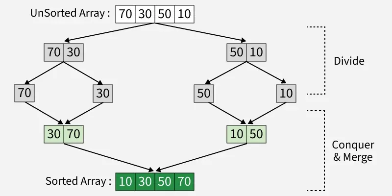

It's a classic divide-and-conquer algorithm, which works by splitting the array into smaller halves recursively until each sub-array contains only one element. Since a single element is inherently sorted, the algorithm then merges these smaller sorted arrays back together in the correct order.

<b>Complexity Breakdown:</b> 
Time Complexity: $O(n \log n)$ across all cases (best, average, and worst) because the algorithm always recursively divides the array into exact halves $( \log n$ levels) and performs linear merge work $O(n)$ at every single level regardless of initial element order Merge Sort Time Complexity.

Space Complexity: $O(n)$ because the algorithm requires a temporary auxiliary array of size $n$ to safely compare and merge elements, which completely dominates the concurrent $O(\log n)$ memory used by the recursive call stack frames Merge Sort Space Complexity.

