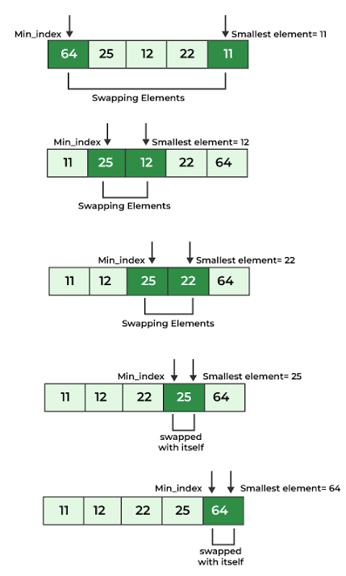

Complexity Breakdown

Time Complexity: $O(n²)$ across best, average, and worst cases because the algorithm always uses nested loops to scan the entire remaining unsorted subarray, regardless of the initial order of the elements.

Space Complexity: $O(1)$ because the algorithm operates entirely in-place, requiring only a constant amount of extra memory for auxiliary loop variables and index pointers

