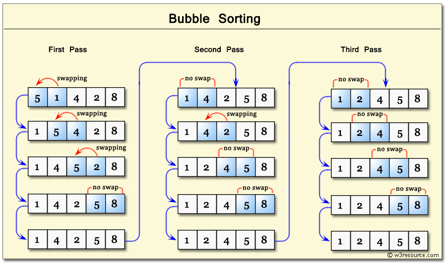

Complexity Breakdown

Time Complexity: $O(n)$ in the best case if the array is already sorted (thanks to the swapped flag optimization), but averages and degrades to $O(n²)$ in the worst case because of the nested loops required to bubble elements to the top.

Space Complexity: $O(1)$ because the algorithm operates entirely in-place, utilizing a constant amount of memory for loop indexes and the boolean flag tracker.

Stable:- yes

