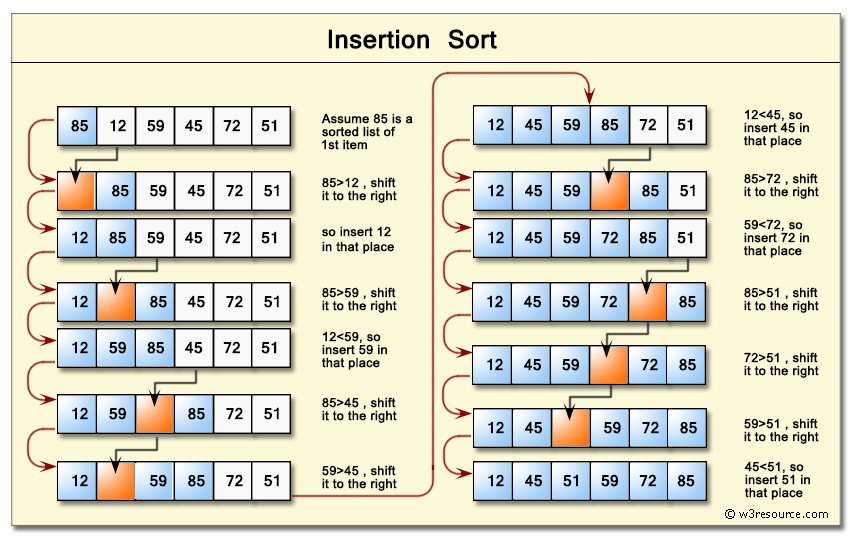
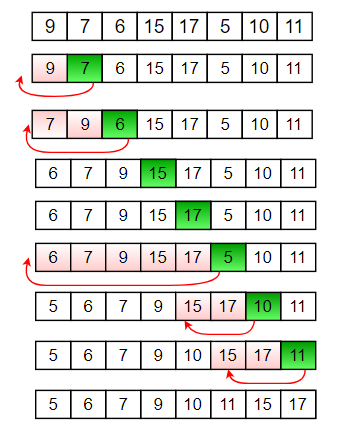

Complexity Breakdown

Time Complexity: $O(n)$ in the best case if the array is already sorted, but averages and degrades to $O(n²)$ in the worst case because each element must be compared and shifted across the sorted subarray.

Space Complexity: $O(1)$ because the algorithm operates entirely in-place, requiring only a fixed amount of extra memory for the key and index tracking variables.

Stable:- yes

another example 

