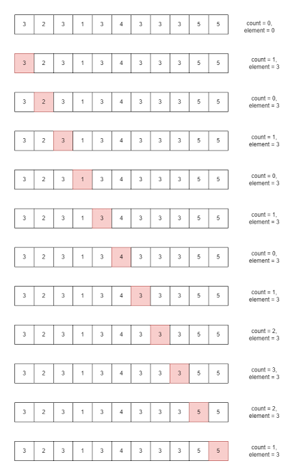

The Boyer–Moore Majority Vote Algorithm is an optimal streaming algorithm that finds the majority element in an array—defined as an element that appears more than $\lfloor n/2 \rfloor$ times—in O(n) time complexity and <b>O(1)</b> space complexity

[leatcode](https://leetcode.com/problem-list/boyer-moore-majority-vote-algorithm/)

Note:- this only works if 1 element is more than half of array size 

(you can also use for <b>elements</b> that occurs $\lfloor n/3 \rfloor$ time or $\lfloor n/4 \rfloor$ times so on, where n is size of array)

- for occuring elements more than $\lfloor n/3 \rfloor$ times the max elements is 2
- for occuring elements more than $\lfloor n/4 \rfloor$ times, max elements are 3

