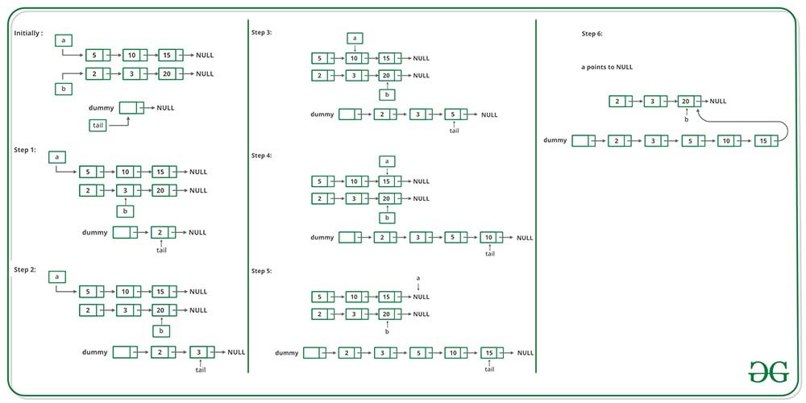

Complexity Breakdown:

Time Complexity: $O(n + m)$ where $n$ and $m$ are the total number of nodes in `list1` and `list2` respectively. Each recursive call processes and consumes one node from either list until one list becomes entirely empty, resulting in a total number of calls equal to the combined length of both lists.

Space Complexity: $O(n + m)$ auxiliary space due to the call stack frames. In the worst-case scenario, the recursion goes as deep as the combined total number of nodes ($n + m$) before reaching the base case, consuming stack memory proportional to that depth.

