<b>LL operation</b>:-  

<!-- findIntersectionPoint, checkPalindrome, segregateEvenOdd, addTwoNumbers -->

- add two numbers in list
    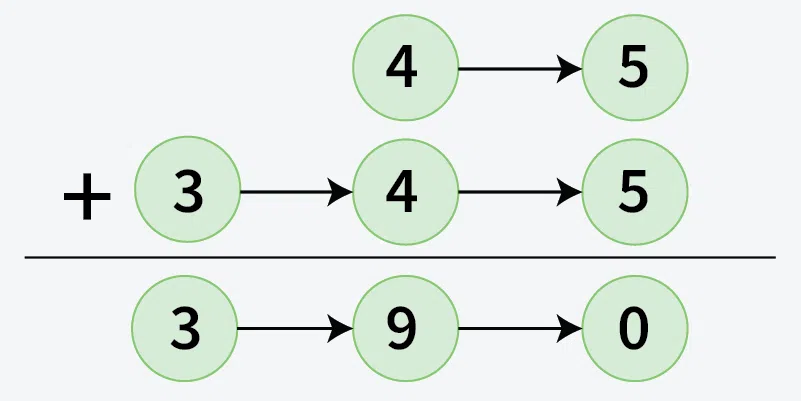

    go through approach:- https://www.geeksforgeeks.org/dsa/add-two-numbers-represented-by-linked-list/

- check palindrome
    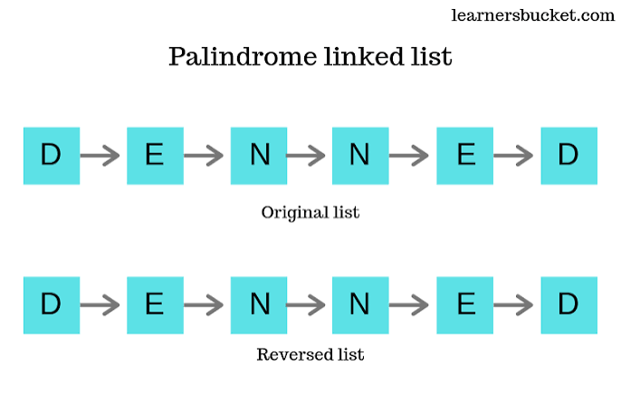

    go through the approachs
    https://www.geeksforgeeks.org/dsa/function-to-check-if-a-singly-linked-list-is-palindrome/

- detectLoop ([leatcode](https://leetcode.com/problems/linked-list-cycle/description/))

    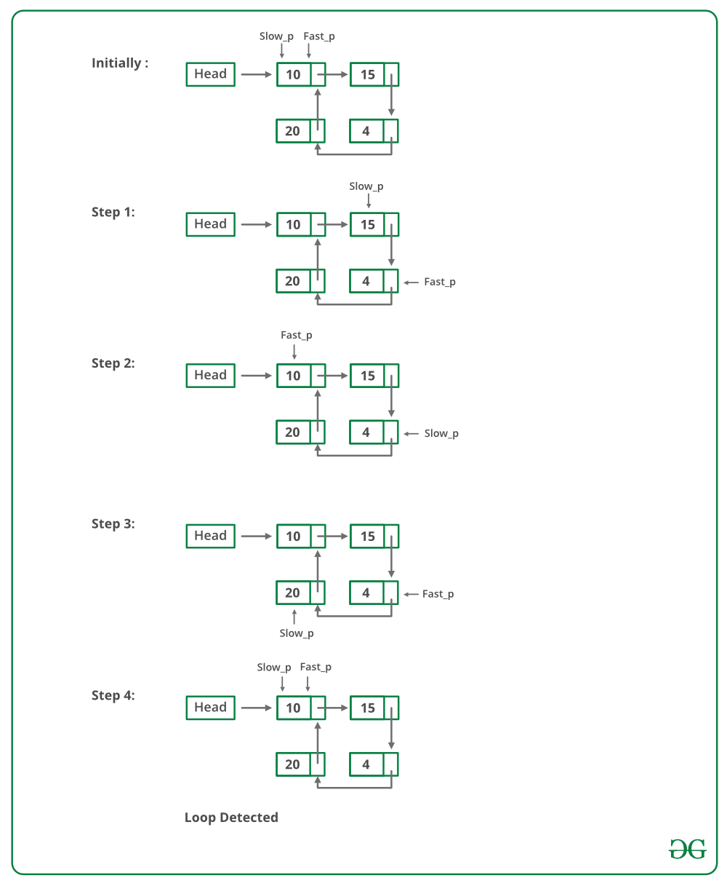

- find interaction point
    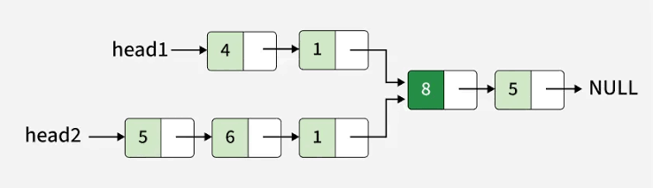

    go through the different approachs
    https://www.geeksforgeeks.org/dsa/write-a-function-to-get-the-intersection-point-of-two-linked-lists/

- Find middle node
    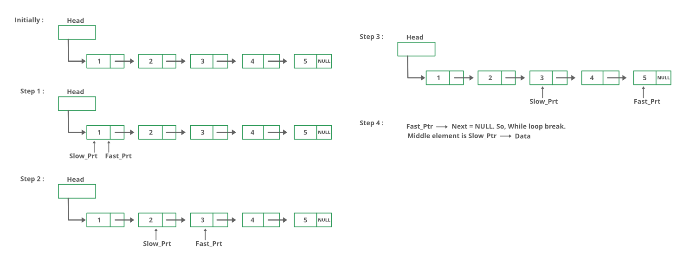

- Find nth node from end in list
    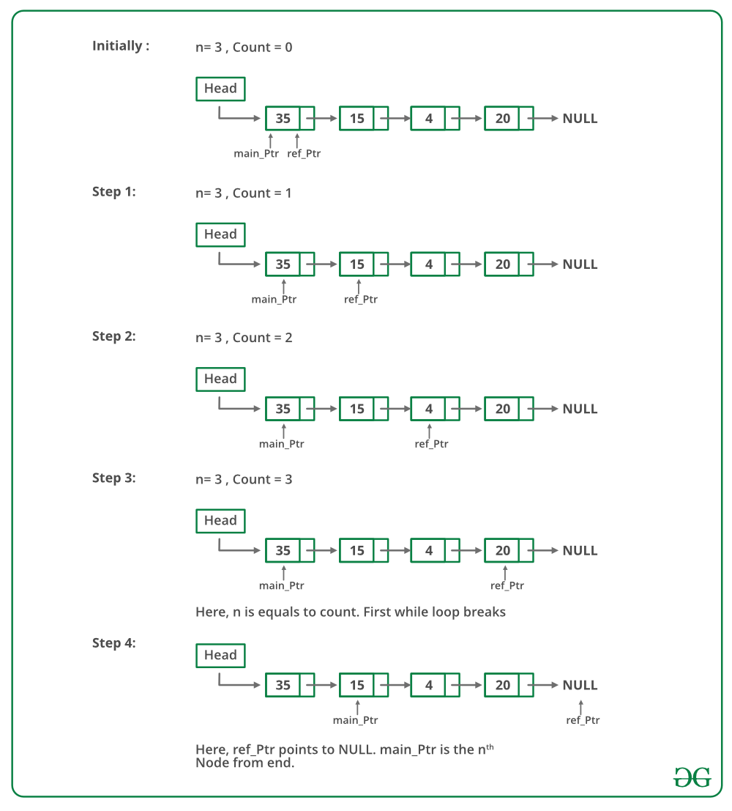

- merge two sorted lists ([leatcode](https://leetcode.com/problems/merge-two-sorted-lists/description/))
    
    - ittrative
    - recursive

    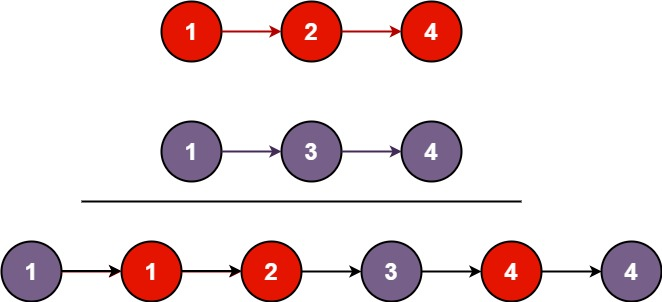

- remove loop in list
    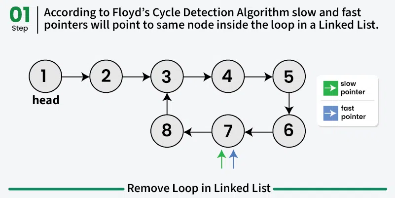
    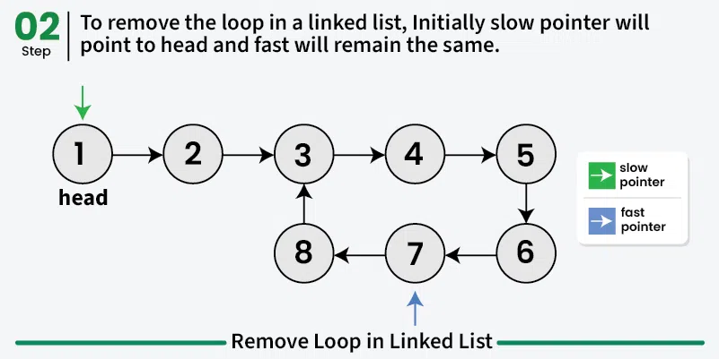
    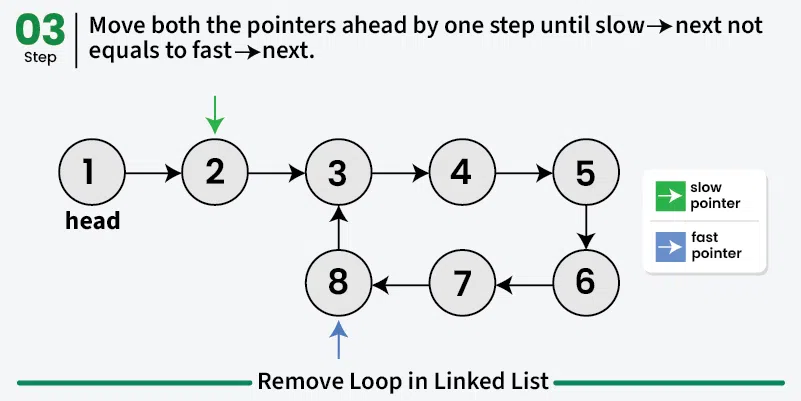
    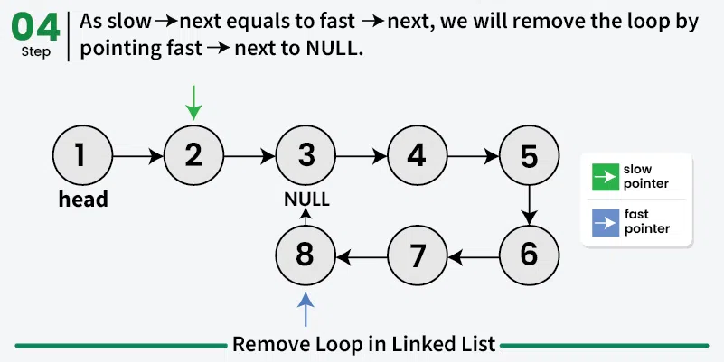

- segregate even odd
    input:
    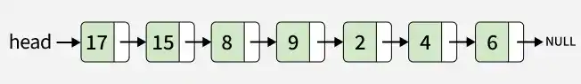
    output:
    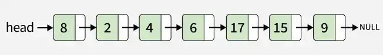
 
- sort List
    - Bubble Sort / Selection Sort
    - Insertion Sort
    - Merge Sort (Highly Recommended)
    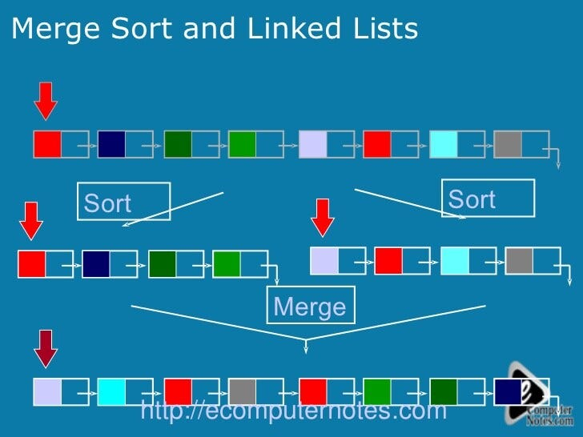
    - Quick Sort

