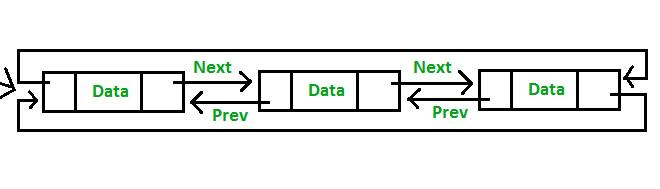

Complexity Breakdown:  

Time Complexity: $O(1)$ for `length`, `insertAtHead`, `insertAtTail`, `deleteAtHead`, and `deleteAtTail` because the combination of a continuous circular link and a backward reference pointer breaks the dependency on linear parsing loops; whereas traverseForward, updateByValue, and reverse remain $O(n)$ because structural content inspection requires scanning all elements consecutively.

Space Complexity: $O(1)$ across all operations since transformations and memory overwrites execute entirely in-place by altering internal struct tracking vectors

