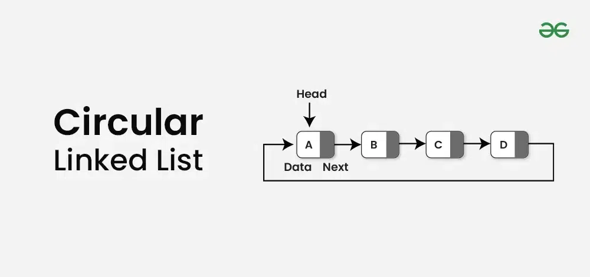

Complexity Breakdown:  

Time Complexity: $O(1)$ for `length`, `insertAtHead`, `insertAtTail`, and `deleteAtHead` because managing references to both boundaries eliminates loops for end connections; whereas `deleteAtTail`, `traverse`, `isExist`, `updateByValue`, and `reverse` require $O(n)$ time due to the unavoidable linear look-ups needed to parse single direction nodes.

Space Complexity: $O(1)$ across all cases because link mutations happen directly on the existing instances using minimal pointer allocations.

