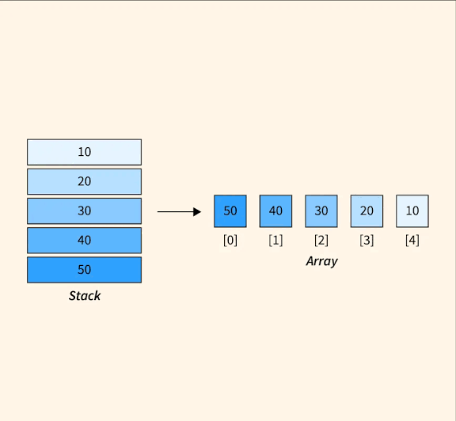
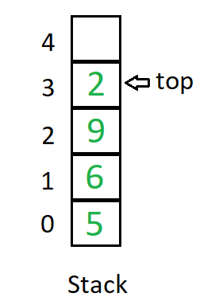

<b>Stack using Dynamic Array</b> 

Complexity Breakdown

`Push(data int)`
- Time Complexity: $O(1)$ Amortized ($O(N)$ worst-case when backing array capacity is exhausted and needs to be reallocated/copied).
- Space Complexity: $O(1)$ auxiliary space (amortized $O(1)$ extra capacity per element due to geometric growth strategy).
- Reason: Go's append automatically grows the underlying array capacity exponentially when full. Most pushes take constant time, with occasional $O(N)$ resizes averaged out over all insertions.

`Pop()`
- Time Complexity: $O(1)$
- Space Complexity: $O(1)$
- Reason: Slicing off the last element takes constant time. (Note: Go does not automatically shrink underlying arrays on pop, avoiding memory thrashing).

`Peek()`
- Time Complexity: $O(1)$
- Space Complexity: $O(1)$: Direct index lookup via len(s.items) - 1.

`IsEmpty() / Size()`
- Time Complexity: $O(1)$
- Space Complexity: $O(1)$
- Reason: Evaluates slice length properties instantly.

Overflow Behavior Note: Unlike fixed-size array stacks, a dynamic stack never experiences stack overflow from a set capacity limit. It will only throw an out-of-memory error if physical system RAM is exhausted. Stack Underflow still applies when trying to pop or peek an empty stack.

<b>Stack using Fixed Array</b> 
Complexity Breakdown 

`Push(data int)`
- Time Complexity: $O(1)$
- Space Complexity: $O(1)$
- Reason: Directly assigns the value to the index tracked by top in constant time without shifting or resizing.

`Pop()`
- Time Complexity: $O(1)$
- Space Complexity: $O(1)$
- Reason: Decrements the top index pointer instantly.

`Peek()`
- Time Complexity: $O(1)$
- Space Complexity: $O(1)$
- Reason: Direct index access via s.top.

`IsEmpty() / IsFull() / Size()`
- Time Complexity: $O(1)$
- Space Complexity: $O(1)$
- Reason: Basic arithmetic evaluation and comparisons on integer fields.

Overall Space Complexity: $O(n)$ where $n$ is the fixed capacity provided when initializing the stack array via make([]int, capacity).

