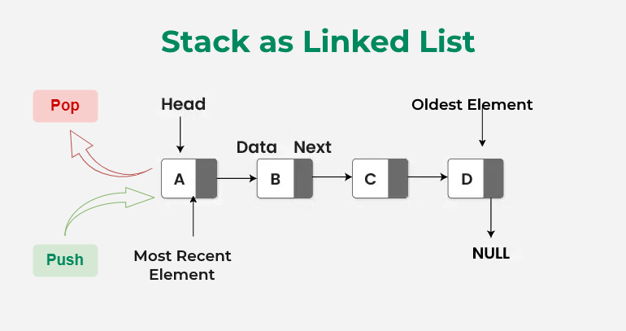

Operations on this linked-list-based stack have the following time and space complexity breakdown:

`push(data int)`
- Time Complexity: $O(1)$
 - Space Complexity: $O(1)$
 - Reason: Adding a new node only requires adjusting the head pointer, which takes constant time regardless of the stack's size.
 
 `pop()`
 - Time Complexity: $O(1)$
 - Space Complexity: $O(1)$
 - Reason: Removing the top element only involves updating the head pointer to point to the next node.
 
 `peek()`
 - Time Complexity: $O(1)$
 - Space Complexity: $O(1)$
 - Reason: Directly accesses the data at the head pointer without traversing the list.
 
 `isEmpty()`
 - Time Complexity: $O(1)$
 - Space Complexity: $O(1)$
 - Reason: Simply evaluates a single pointer comparison (s.head == nil).
 
 `size()`
 - Time Complexity: $O(N)$ (where $N$ is the number of elements in the stack)
 - Space Complexity: $O(1)$
 - Reason: Traverses the entire linked list from top to bottom to count the nodes. (Note: If you need $O(1)$ size, you could maintain an integer counter field inside the Stack struct and increment/decrement it during push/pop operations).
 
`printStack()`
- Time Complexity: $O(N)$
- Space Complexity: $O(1)$
- Reason: Iterates through all $N$ nodes to print their values to standard output.

Overall Space Complexity (Data Structure Storage): $O(N)$ to store $N$ elements in dynamically allocated nodes.
