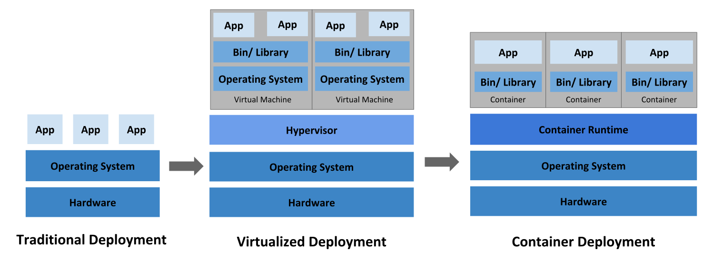
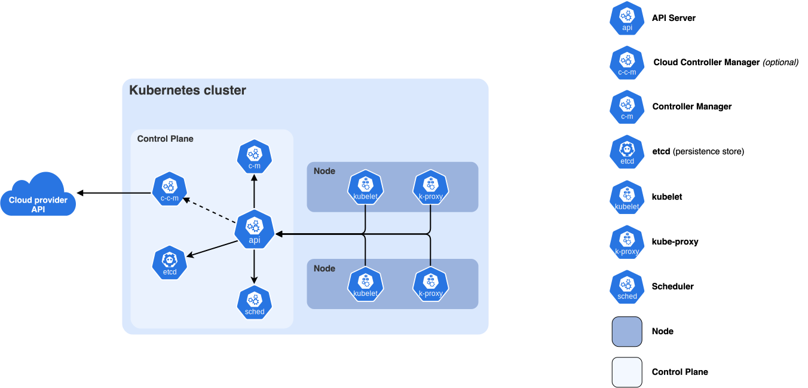
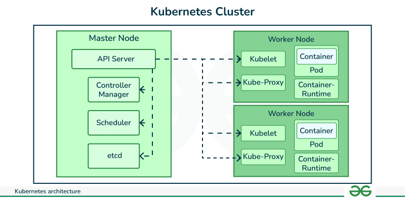

# Kubernetes

<!-- OVERVEW START -->
<details>
<summary>
<b>Overview</b>
</summary>
<dev>
<!------------------------------------------------------------------->
<details>
<summary>
<b>Why you need Kubernetes and what it can do</b>
</summary>
<dev>
Containers are a good way to bundle and run your applications. In a production environment, you need to manage the containers that run the applications and ensure that there is no downtime. For example, if a container goes down, another container needs to start. Wouldn't it be easier if this behavior was handled by a system?

That's how Kubernetes comes to the rescue! Kubernetes provides you with a framework to run distributed systems resiliently. It takes care of scaling and failover for your application, provides deployment patterns, and more. For example: Kubernetes can easily manage a canary deployment for your system.

Kubernetes provides you with:

- <b>Service discovery and load balancing</b> Kubernetes can expose a container using a DNS name or its own IP address. If traffic to a container is high, Kubernetes is able to load balance and distribute the network traffic so that the deployment is stable.
- <b>Storage orchestration</b> Kubernetes allows you to automatically mount a storage system of your choice, such as local storage, public cloud providers, and more.
- <b>Automated rollouts and rollbacks</b> You can describe the desired state for your deployed containers using Kubernetes, and it can change the actual state to the desired state at a controlled rate. For example, you can automate Kubernetes to create new containers for your deployment, remove existing containers and adopt all their resources to the new container.
- <b>Automatic bin packing</b> You provide Kubernetes with a cluster of nodes that it can use to run containerized tasks. You tell Kubernetes how much CPU and memory (RAM) each container needs. Kubernetes can fit containers onto your nodes to make the best use of your resources.
- <b>Self-healing</b> Kubernetes restarts containers that fail, replaces containers, kills containers that don't respond to your user-defined health check, and doesn't advertise them to clients until they are ready to serve.
- <b>Secret and configuration management</b> Kubernetes lets you store and manage sensitive information, such as passwords, OAuth tokens, and SSH keys. You can deploy and update secrets and application configuration without rebuilding your container images, and without exposing secrets in your stack configuration.
- <b>Batch execution</b> In addition to services, Kubernetes can manage your batch and CI workloads, replacing containers that fail, if desired.
- <b>Horizontal scaling</b> Scale your application up and down with a simple command, with a UI, or automatically based on CPU usage.
- <b>IPv4/IPv6 dual-stack</b> Allocation of IPv4 and IPv6 addresses to Pods and Services.
- <b>Designed for extensibility</b> Add features to your Kubernetes cluster without changing upstream source code.
</dev>
</details>

<!------------------------------------------------------------------->

<details>
<summary>
<b>What Kubernetes is not</b>
</summary>
<dev>

Kubernetes is not a traditional, all-inclusive PaaS (Platform as a Service) system. Since Kubernetes operates at the container level rather than at the hardware level, it provides some generally applicable features common to PaaS offerings, such as deployment, scaling, load balancing, and lets users integrate their logging, monitoring, and alerting solutions. However, Kubernetes is not monolithic, and these default solutions are optional and pluggable. Kubernetes provides the building blocks for building developer platforms, but preserves user choice and flexibility where it is important.

Kubernetes:

- Does not limit the types of applications supported. Kubernetes aims to support an extremely diverse variety of workloads, including stateless, stateful, and data-processing workloads. If an application can run in a container, it should run great on Kubernetes.
- Does not deploy source code and does not build your application. Continuous Integration, Delivery, and Deployment (CI/CD) workflows are determined by organization cultures and preferences as well as technical requirements.
- Does not provide application-level services, such as middleware (for example, message buses), data-processing frameworks (for example, Spark), databases (for example, MySQL), caches, nor cluster storage systems (for example, Ceph) as built-in services. Such components can run on Kubernetes, and/or can be accessed by applications running on Kubernetes through portable mechanisms, such as the Open Service Broker.
- Does not dictate logging, monitoring, or alerting solutions. It provides some integrations as proof of concept, and mechanisms to collect and export metrics.
- Does not provide nor mandate a configuration language/system (for example, Jsonnet). It provides a declarative API that may be targeted by arbitrary forms of declarative specifications.
- Does not provide nor adopt any comprehensive machine configuration, maintenance, management, or self-healing systems.
- Additionally, Kubernetes is not a mere orchestration system. In fact, it eliminates the need for orchestration. The technical definition of orchestration is execution of a defined workflow: first do A, then B, then C. In contrast, Kubernetes comprises a set of independent, composable control processes that continuously drive the current state towards the provided desired state. It shouldn't matter how you get from A to C. Centralized control is also not required. This results in a system that is easier to use and more powerful, robust, resilient, and extensible.

</dev>
</details>

<!------------------------------------------------------------------->

<details>
<summary>
<b>Historical context for Kubernetes</b>
</summary>
<dev>

Let's take a look at why Kubernetes is so useful by going back in time.



<b>Traditional deployment era:</b>

Early on, organizations ran applications on physical servers. There was no way to define resource boundaries for applications in a physical server, and this caused resource allocation issues. For example, if multiple applications run on a physical server, there can be instances where one application would take up most of the resources, and as a result, the other applications would underperform. A solution for this would be to run each application on a different physical server. But this did not scale as resources were underutilized, and it was expensive for organizations to maintain many physical servers.

<b>Virtualized deployment era:</b>

As a solution, virtualization was introduced. It allows you to run multiple Virtual Machines (VMs) on a single physical server's CPU. Virtualization allows applications to be isolated between VMs and provides a level of security as the information of one application cannot be freely accessed by another application.

Virtualization allows better utilization of resources in a physical server and allows better scalability because an application can be added or updated easily, reduces hardware costs, and much more. With virtualization you can present a set of physical resources as a cluster of disposable virtual machines.

Each VM is a full machine running all the components, including its own operating system, on top of the virtualized hardware.

<b>Container deployment era:</b>

Containers are similar to VMs, but they have relaxed isolation properties to share the Operating System (OS) among the applications. Therefore, containers are considered lightweight. Similar to a VM, a container has its own filesystem, share of CPU, memory, process space, and more. As they are decoupled from the underlying infrastructure, they are portable across clouds and OS distributions.

Containers have become popular because they provide extra benefits, such as:

Agile application creation and deployment: increased ease and efficiency of container image creation compared to VM image use.
Continuous development, integration, and deployment: provides reliable and frequent container image build and deployment with quick and efficient rollbacks (due to image immutability).
Dev and Ops separation of concerns: create application container images at build/release time rather than deployment time, thereby decoupling applications from infrastructure.
Observability: not only surfaces OS-level information and metrics, but also application health and other signals.
Environmental consistency across development, testing, and production: runs the same on a laptop as it does in the cloud.
Cloud and OS distribution portability: runs on Ubuntu, RHEL, CoreOS, on-premises, on major public clouds, and anywhere else.
Application-centric management: raises the level of abstraction from running an OS on virtual hardware to running an application on an OS using logical resources.
Loosely coupled, distributed, elastic, liberated micro-services: applications are broken into smaller, independent pieces and can be deployed and managed dynamically – not a monolithic stack running on one big single-purpose machine.
Resource isolation: predictable application performance.
Resource utilization: high efficiency and density

</dev>
</details>

<!------------------------------------------------------------------->

<!-- Kubernetes Components START -->


<details>
<summary>
<b>Kubernetes Components</b>
</summary>
<dev>



## Core Components
A Kubernetes cluster consists of a control plane and one or more worker nodes. Here's a brief overview of the main components:

### Control Plane Components

This is brain of kubernetes, Manage the overall state of the cluster:

- <b>kube-apiserver</b> The core component server that exposes the Kubernetes HTTP API.
- <b>etcd </b> Consistent and highly-available key value store for all API server data.(Database of Kubernetes.) Stores:
    - Pods
    - Deployments
    - Services
    - Secrets
    - ConfigMaps

- <b> kube-scheduler </b> Looks for Pods not yet bound to a node, and assigns each Pod to a suitable node.
- <b> kube-controller-manager </b> Runs controllers to implement Kubernetes API behavior.
- <b> cloud-controller-manager (optional) </b> Integrates with underlying cloud provider(s).

### Node Components

Run on every node, maintaining running pods and providing the Kubernetes runtime environment:

- <b> kubelet</b>Ensures that Pods are running, including their containers.
- <b> kube-proxy (optional)</b>Maintains network rules on nodes to implement Services.
- <b> Container runtime</b>Software responsible for running containers.

</dev>
</details>


<!-- Kubernetes Components END -->


<details>
<summary>
<b>Objects In Kubernetes</b>
</summary>
<dev>

A Kubernetes object is a "record of intent"--once you create the object, the Kubernetes system will constantly work to ensure that the object exists. By creating an object, you're effectively telling the Kubernetes system what you want your cluster's workload to look like; this is your cluster's desired state.

To work with Kubernetes objects—whether to create, modify, or delete them—you'll need to use the Kubernetes API. When you use the kubectl command-line interface, for example, the CLI makes the necessary Kubernetes API calls for you. You can also use the Kubernetes API directly in your own programs using one of the Client Libraries


<b>Object spec and status</b> :-
For example: in Kubernetes, a Deployment is an object that can represent an application running on your cluster. When you create the Deployment, you might set the Deployment spec to specify that you want three replicas of the application to be running. The Kubernetes system reads the Deployment spec and starts three instances of your desired application--updating the status to match your spec. If any of those instances should fail (a status change), the Kubernetes system responds to the difference between spec and status by making a correction--in this case, starting a replacement instance.

<b> Describing a Kubernetes object</b> :- 
When you create an object in Kubernetes, you must provide the object spec that describes its desired state, as well as some basic information about the object (such as a name). When you use the Kubernetes API to create the object (either directly or via kubectl), that API request must include that information as JSON in the request body. Most often, you provide the information to kubectl in a file known as a manifest. By convention, manifests are YAML (you could also use JSON format). Tools such as kubectl convert the information from a manifest into JSON or another supported serialization format when making the API request over HTTP.

Here's an example manifest that shows the required fields and object spec for a Kubernetes Deployment:

application/deployment.yaml
```
apiVersion: apps/v1
kind: Deployment
metadata:
  name: nginx-deployment
spec:
  selector:
    matchLabels:
      app: nginx
  replicas: 2 # tells deployment to run 2 pods matching the template
  template:
    metadata:
      labels:
        app: nginx
    spec:
      containers:
      - name: nginx
        image: nginx:1.14.2
        ports:
        - containerPort: 80

```

One way to create a Deployment using a manifest file like the one above is to use the kubectl apply command in the kubectl command-line interface, passing the .yaml file as an argument. Here's an example:
```
kubectl apply -f https://k8s.io/examples/application/deployment.yaml
```
The output is similar to this:
```
deployment.apps/nginx-deployment created
```

<b>Required fields</b>:-
In the manifest (YAML or JSON file) for the Kubernetes object you want to create, you'll need to set values for the following fields:

- ```apiVersion``` - Which version of the Kubernetes API you're using to create this object
- ```kind``` - What kind of object you want to create
- ```metadata``` - Data that helps uniquely identify the object, including a name string, UID, and optional namespace
- ```spec``` - What state you desire for the object

The precise format of the object spec is different for every Kubernetes object, and contains nested fields specific to that object. The Kubernetes API Reference can help you find the spec format for all of the objects you can create using Kubernetes.

For example, see the spec field for the Pod API reference. For each Pod, the .spec field specifies the pod and its desired state (such as the container image name for each container within that pod). Another example of an object specification is the spec field for the StatefulSet API. For StatefulSet, the .spec field specifies the StatefulSet and its desired state. Within the .spec of a StatefulSet is a template for Pod objects. That template describes Pods that the StatefulSet controller will create in order to satisfy the StatefulSet specification. Different kinds of objects can also have different .status; again, the API reference pages detail the structure of that .status field, and its content for each different type of object.

find the commands here:
``` 
https://kubernetes.io/docs/reference/generated/kubectl/kubectl-commands#-strong-getting-started-strong- 
```
</dev>
</details>


</dev>
</details>


<!-- OVERVEW END -->


<!-- Cluster Architecture END -->
<details>
<summary>
<b>Cluster Architecture</b>
</summary>
<dev>




<b>Cluster</b>:- A set of nodes managed by Kubernetes control plane.
```
Cluster
 ├── Control Plane
 ├── Node1
 ├── Node2
 └── Node3
 ```

 <b>Node</b>:- A virtual or physical machine on which one or more kubernetes pods run. nodes can be:

  - VM
  - EC2
  - Physical Server

```
Node
 ├── kubelet
 ├── container runtime
 ├── pods
 └── kube-proxy
```
There are two main ways to have Nodes added to the API server:

- The kubelet on a node self-registers to the control plane
- You (or another human user) manually add a Node object

After you create a Node object, or the kubelet on a node self-registers, the control plane checks whether the new Node object is valid. For example, if you try to create a Node from the following JSON manifest:
```
{
  "kind": "Node",
  "apiVersion": "v1",
  "metadata": {
    "name": "10.240.79.157",
    "labels": {
      "name": "my-first-k8s-node"
    }
  }
}
```
Kubernetes creates a Node object internally (the representation). Kubernetes checks that a kubelet has registered to the API server that matches the metadata.name field of the Node. If the node is healthy (i.e. all necessary services are running), then it is eligible to run a Pod. Otherwise, that node is ignored for any cluster activity until it becomes healthy.

<b>Pod</b>:- Pods are the smallest deployable units of computing that you can create and manage in Kubernetes. pods have:
- IP
- Storage
- Network
```
Pod
 ├── App Container
 └── Sidecar Container
```
Create a pod:<br>
pod.yaml
```
apiVersion: v1
kind: Pod
metadata:
  name: nginx
spec:
  containers:
  - name: nginx
    image: nginx
```
then Run: 
```
kubectl apply -f pod.yaml
```
check
```
kubectl get pods
```

<b>ReplicaSet</b>:- A ReplicaSet's purpose is to maintain a stable set of replica Pods running at any given time. As such, it is often used to guarantee the availability of a specified number of identical Pods. Usually, you define a Deployment and let that Deployment manage ReplicaSets automatically.

Example: (NOTE: we recommend using Deployments instead of directly using ReplicaSets, unless you require custom update orchestration or don't require updates at all)
```
apiVersion: apps/v1
kind: ReplicaSet
metadata:
  name: frontend
  labels:
    app: guestbook
    tier: frontend
spec:
  # modify replicas according to your case
  replicas: 3
  selector:
    matchLabels:
      tier: frontend
  template:
    metadata:
      labels:
        tier: frontend
    spec:
      containers:
      - name: php-redis
        image: us-docker.pkg.dev/google-samples/containers/gke/gb-frontend:v5

```

<b>Deployments</b>:- A Deployment manages a set of Pods to run an application workload, usually one that doesn't maintain state.

A Deployment is a resource object for managing Pods and ReplicaSets via a declarative configuration, which define a desired state that describes the application workload life cycle, number of pods, deployment strategies, container images, and more. The Deployment Controller works to ensure the actual state matches desired state, such as by replacing a failed pod. Out of the box, Deployments support several deployment strategies, like "recreate" and "rolling update", however can be customized to support more advanced deployment strategies such as blue/green or canary deployments.

```
Deployment
      ↓
 ReplicaSet
      ↓
    Pods
```
Commands:
- Run kubectl get deployments to check if the Deployment was created
```
>kubectl get deployments
NAME               READY   UP-TO-DATE   AVAILABLE   AGE
nginx-deployment   0/3     0            0           1s
```
- check roolout(deployment) status or To see the Deployment rollout status, run:
```
>kubectl rollout status deployment/nginx-deployment
Waiting for rollout to finish: 2 out of 3 new replicas have been updated...
deployment "nginx-deployment" successfully rolled out
```
- To see the ReplicaSet (rs) created by the Deployment, run:
```
> kubectl get rs
NAME                          DESIRED   CURRENT   READY   AGE
nginx-deployment-75675f5897   3         3         3       18s
```
- To see the labels automatically generated for each Pod, run:
```
>kubectl get pods --show-labels
NAME                                READY     STATUS    RESTARTS   AGE       LABELS
nginx-deployment-75675f5897-7ci7o   1/1       Running   0          18s       app=nginx,pod-template-hash=75675f5897
nginx-deployment-75675f5897-kzszj   1/1       Running   0          18s       app=nginx,pod-template-hash=75675f5897
nginx-deployment-75675f5897-qqcnn   1/1       Running   0          18s       app=nginx,pod-template-hash=75675f5897
```

</dev>
</details>
<!-- Cluster Architecture END -->

------------------------------------------------------------

<!-- 
<details>
<summary>
<b>next</b>
</summary>
<dev>

jjj

</dev>
</details>
-->